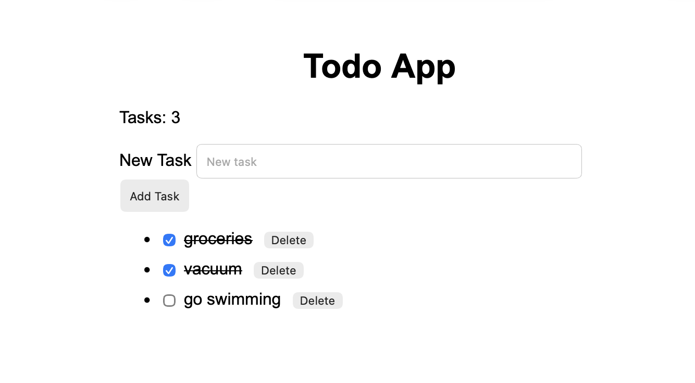

# Todo App

A simple and clean Todo application built with JavaScript to practice DOM manipulation, event handling, and local storage.

## Preview

## Features
- Add new tasks
- Delete tasks
- Mark tasks as completed
- Task counter
- Saves tasks using Local Storage (data persists after refresh)

## Technologies
- HTML
- CSS
- JavaScript (Vanilla)
- DOM Manipulation
- Local Storage

## What I Learned
- Creating and managing DOM elements dynamically
- Handling user input and events (click & keyboard)
- Structuring JavaScript logic for real applications
- Persisting data in the browser using localStorage
- Debugging real issues and fixing bugs
- Using Git & GitHub for version control

## How to Run
1. Open the project folder  
2. Open `index.html` in your browser  
3. Start adding tasks  

## Status
Finished basic todo app with persistent funcionality

## Notes 
This project was built to strengthen my JavaScript fundamentals before starting my Computer Science degree